# FairLaunchpad - Solidity bootcamp capstone project

Simple and fair Launchpad contract that assures that winners choice is public and verifiable.
It allows project to make their tokens presale to a capped amount of investors at a fixed price.
This allows the projects to gain some financing while assuring that their token is a scarce and desirable resource.

### Contract Lifecycle

### Roadmap

In the future we aim to enhance the project in the following way:

- come up with a catchy name, ideas much appreciated
- add a FairLaunchpadFactory making the process much easier for the projects
- add a governing DAO that will have a role of accepting or rejecting projects that want to participate. This aims to prevent malicious projects from scamming inattentive investors.

### Workflow

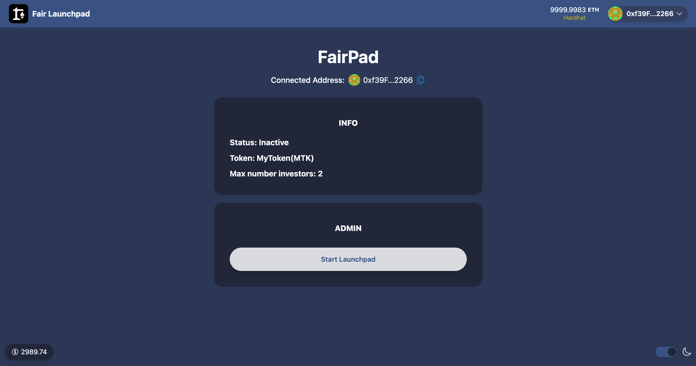

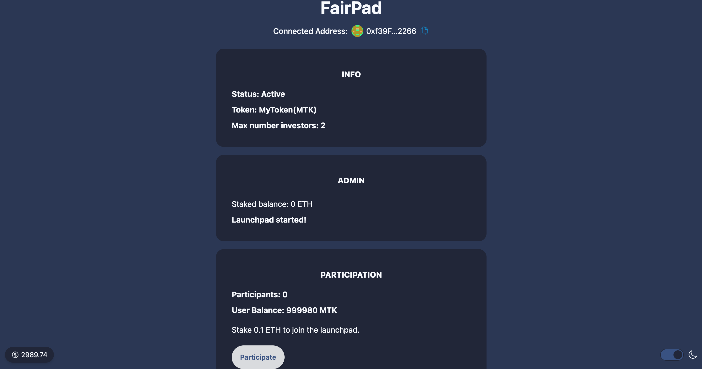

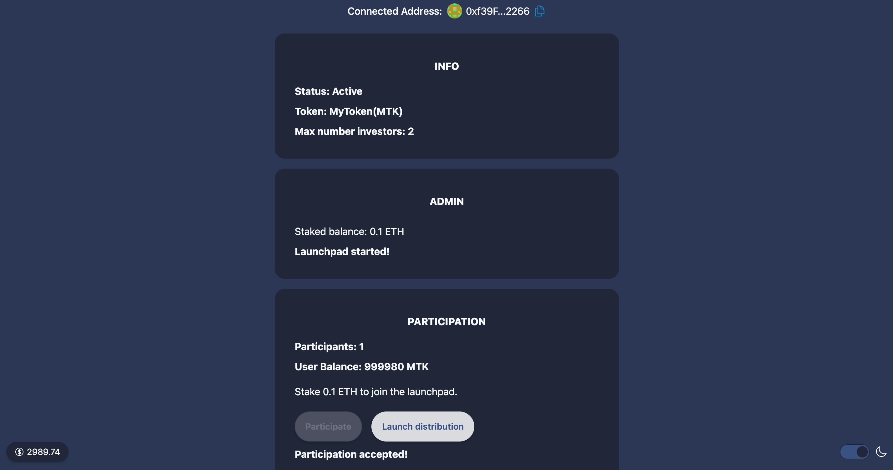

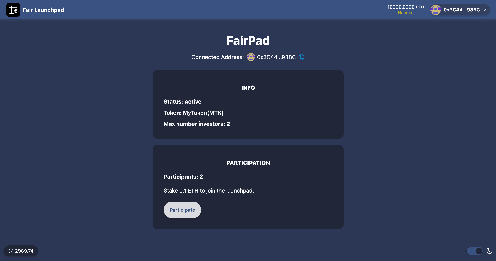

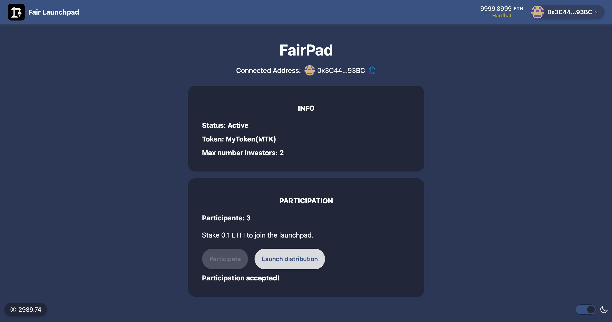

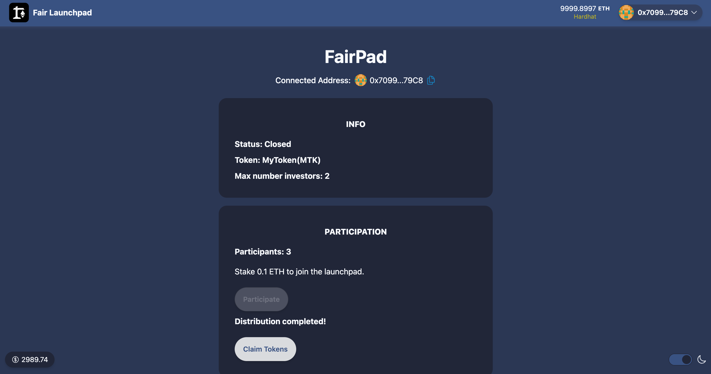

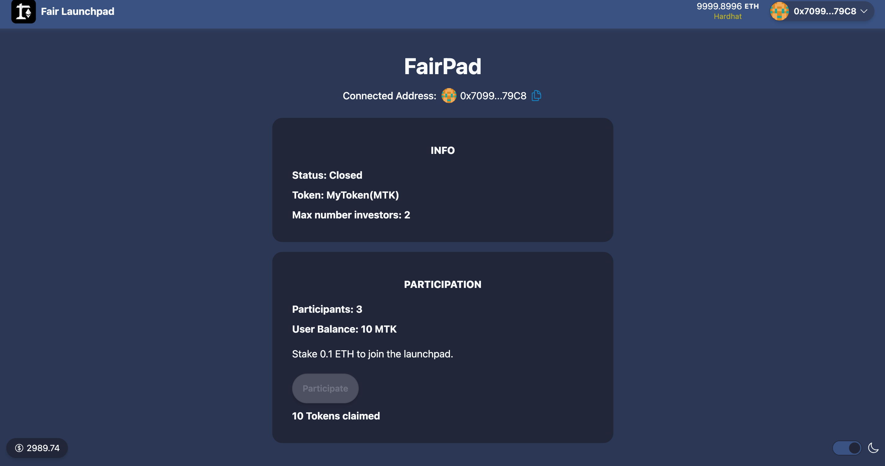

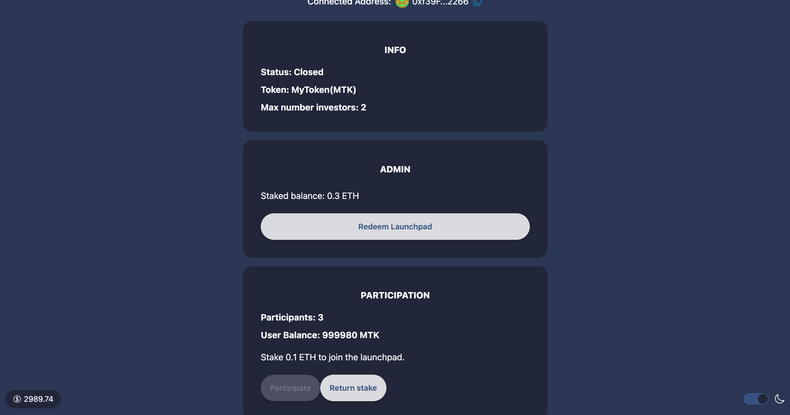

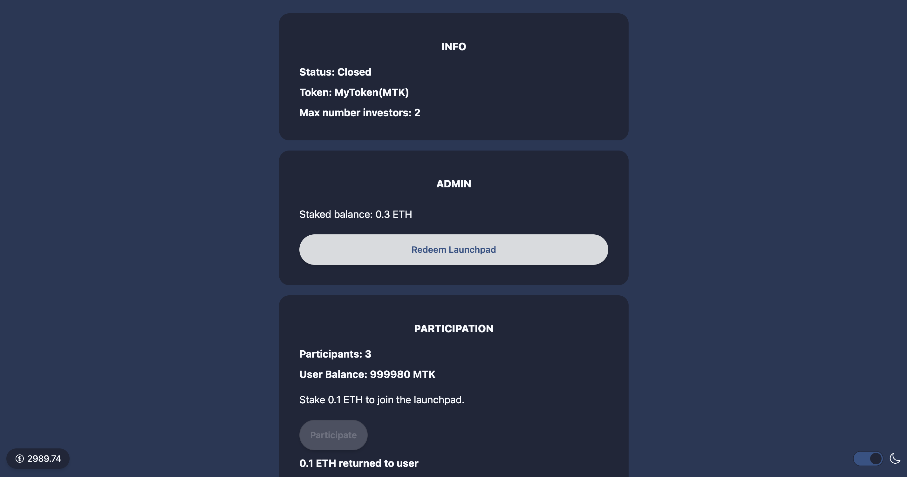

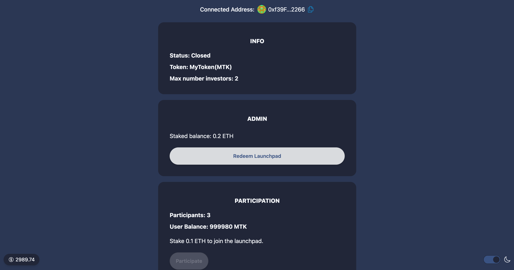

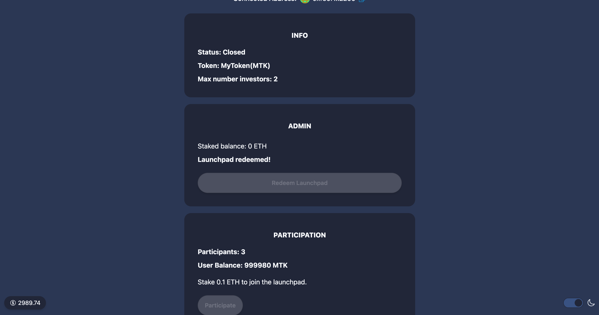
